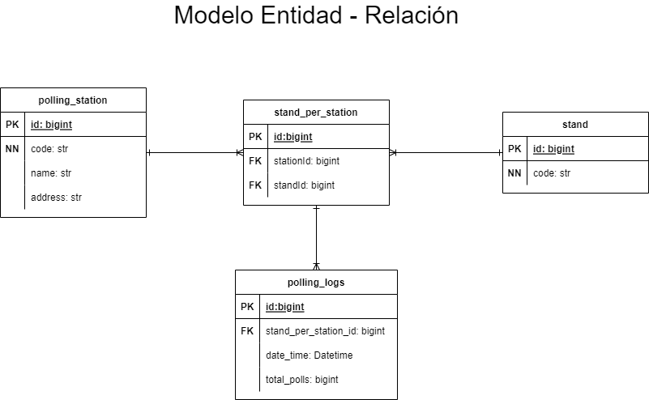
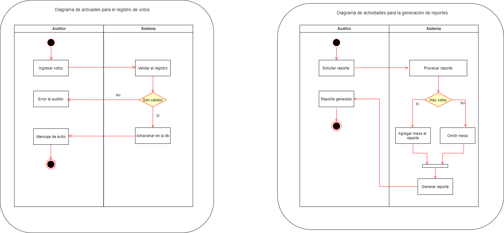

# Registraduria app SynergySoft

### API REST de la aplicación para auditoría de votos de la registraduría, prueba técnica para SynergySoft.

## Funcionalidades

- Creación de un registro de votos que se han realizado en una mesa en algún lugar de votación.
- Obtención de los lugares de votación.
- Obtención de la cantidad de mesas que tiene un lugar de votación.
- Generación de reportes que resumen los votos recogidos por mesa de cada lugar de votación.

## Tecnologías usadas

- Spring Boot: Framework de desarrollo basado en el lenguaje Java (11).
- SQL Server: Sistema de gestión de bases de datos.
- Azure: Se utilizó esta herramienta para crear la instancia de la base de datos en la nube.
- Github: Herramienta para gestionar el código.
- Github Actions: herramienta usada para la creación de un Pipeline que se encarga de la integración continua, entrega continua y despliegue continuo.
- Heroku: Herramienta utilizada para el deploy de la aplicación en la nube, mediante el Pipeline se envia la señal de despliegue continuo hacia esta plataforma.

## Técnicas usadas
- Gitflow: metodoligía de trabajo en git para manejar los cambios mediante features.
- Modelación UML: diagramas UML para una buena definición del diseño.
- Principios SOLID

## Arquitectura
### Modelo Entidad Relación

Diagrama para la defición del esquema de la base de datos

### Diagrama de procesos

Diagrama para entender los procesos que se llevaran acabo en la aplicación

## Patrones de arquitectura

- Cliente servidor: en el contexto general se usó este patrón de arquitectura donde el servidor es la aplicación backend y el cliente es una aplicación Android.
- N Capas: en esta parte del backend se utilizaron 4 capas: Capa de modelo, acceso a datos, lógica de negocios y vista. En la capa de modelo se encuentran las entidades necesarias y los objetos de transferencia de datos (DTO), en la capa de acceso a datos, se encuentra las consultas que se realizan a la base de datos para obtener la información, en la capa de lógica de negocios se encuentran los servicios de la aplicación de acuerdo  a las necesidades del cliente y por último, en la capa de vista se encuentran los controladores que se encargan de exponer los endpoint al cliente que va a consumir la api.

## Patrones de diseño

- Inyeccion de dependencias (por campo y por constructor)
- Repositorio
- Data Transfer Object (DTO)
- Builder

## Documentación de la API

https://registraduria-app.herokuapp.com/swagger-ui/index.html

## Link del repositorio

https://github.com/SotalvaroO/registraduria-app.git

## Diagramas
- Entidad Relación: https://drive.google.com/file/d/1PqrecMTw_RbrgFaWjPawyFcwbQGnh2h8/view?usp=sharing
- Diagrama de procesos: https://drive.google.com/file/d/1dFaNedCfM9ukl0VbPHvubSx_4qS59LIS/view?usp=sharing
